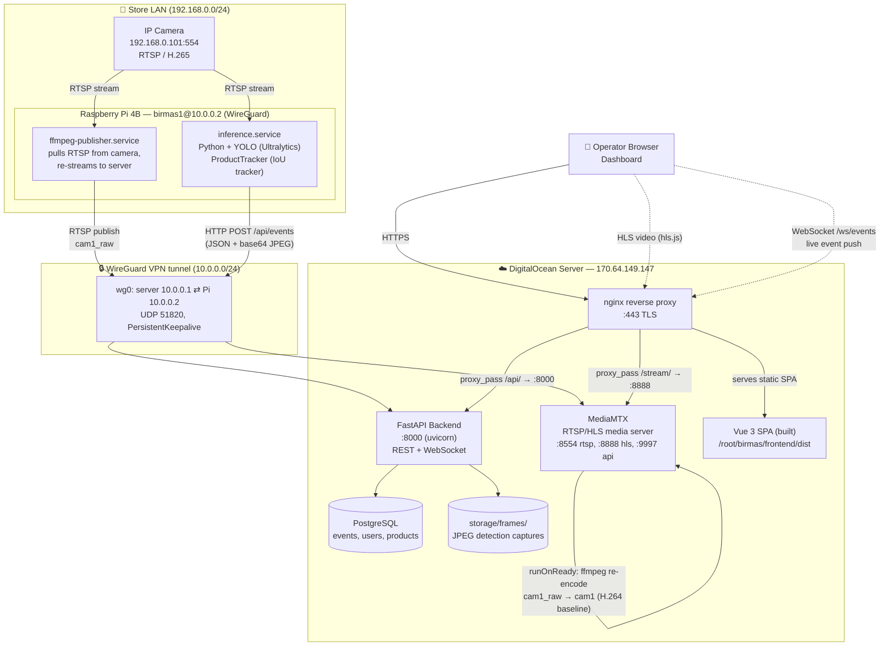
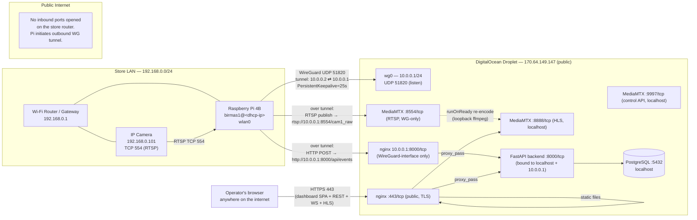
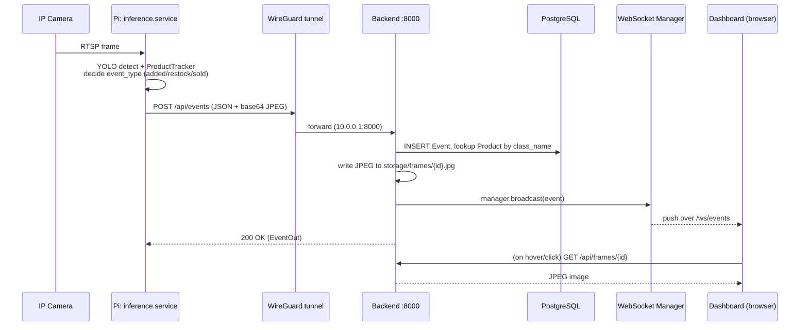
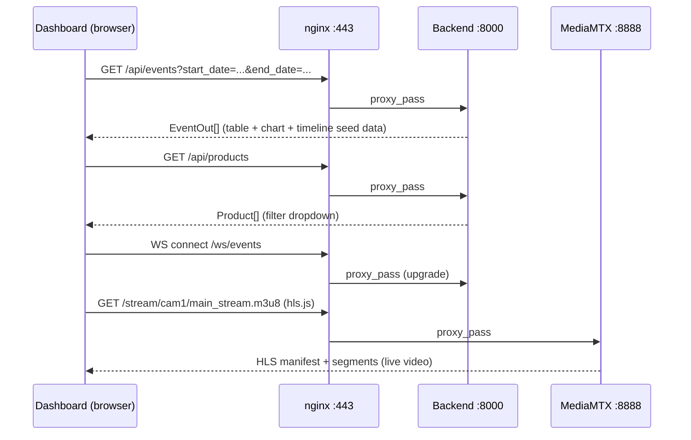
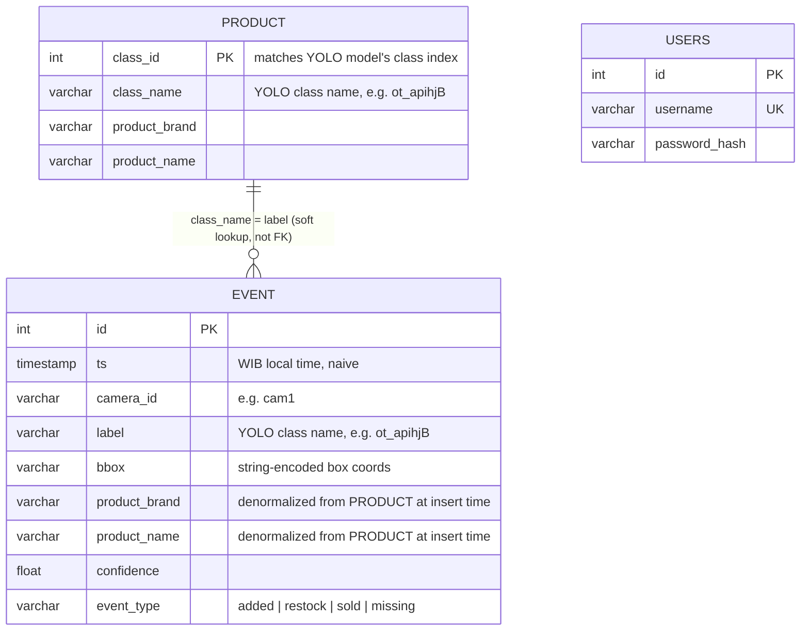
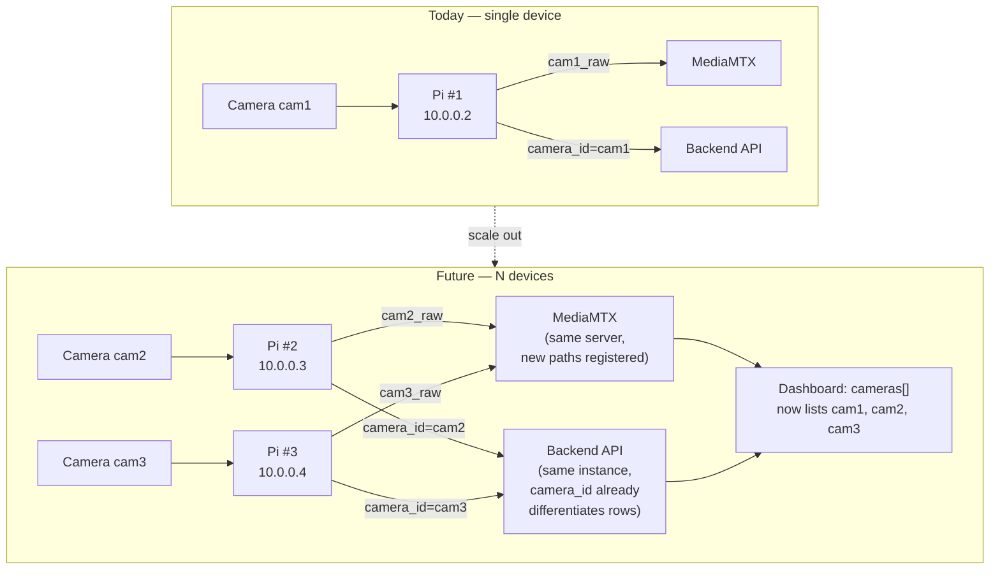

# Birmas CCTV System — Complete Reference

This is a single-file merge of all system documentation, for easy export/reading/presentation. Individual topic files also exist separately in this `docs/` folder if you prefer to work with one at a time.

## Table of Contents

- [Architecture](#architecture)
- [Network Diagram](#network-diagram)
- [API Diagram](#api-diagram)
- [Database](#database)
- [Dashboard](#dashboard)
- [Adding More Devices](#adding-more-devices)
- [Developer Guide](#developer-guide)

---

## Architecture

This document describes the overall system architecture of the Birmas smart
CCTV / inventory-detection system: a Raspberry Pi at the store captures video
from an IP camera, runs YOLO product-detection inference, and reports
"added / restock / sold" events to a cloud server, which stores them and
serves a live dashboard (live video + event timeline + charts).

### High-level component diagram



### Components

#### 1. Camera (store)
- Hikvision-style IP camera, RTSP source at `192.168.0.101:554/Streaming/Channels/101`.
- Two consumers on the Pi pull from it independently: the publisher (for live
  video relay) and the inference process (for detection).

#### 2. Raspberry Pi (store edge device)
- **`ffmpeg-publisher.service`** — a thin relay: pulls the camera's RTSP
  stream and republishes it over the WireGuard tunnel to the server's
  MediaMTX instance at `rtsp://10.0.0.1:8554/cam1_raw`. Runs as a systemd
  service (`Restart=always`), defined in `systemd/ffmpeg-publisher.service`.
- **`inference.service`** — Python process (`inference/main.py`) that:
  1. Opens its own RTSP connection to the camera.
  2. Runs YOLO (Ultralytics, `inference/models/best.pt`) per frame to detect
     products.
  3. Feeds detections into a lightweight local IoU-based tracker
     (`inference/tracker.py`, class `ProductTracker`) to assign stable
     track IDs and decide `added` / `restock` / `sold` transitions based on
     dwell time (`LOG_TTL`) and/or a configured fridge zone (`FRIDGE_ZONE`).
  4. POSTs each event as JSON (including a base64-encoded JPEG frame
     capture) to the backend's `/api/events` endpoint over the WireGuard
     tunnel.
  - Runs inside a Python venv at `~/birmas/venv` built with
    `--system-site-packages` so it can reuse apt-installed ARM-optimized
    wheels for opencv/torch/scipy/torchvision (pip-compiling these from
    source on Pi previously caused OOM crashes).

#### 3. WireGuard VPN
- Private overlay network `10.0.0.0/24` between server (`10.0.0.1`) and Pi
  (`10.0.0.2`). This is the **only** path between store and cloud — the Pi
  is never directly exposed to the internet, and the backend API/RTSP ports
  are not published on the server's public interface.

#### 4. Server — MediaMTX
- Receives the raw camera relay on `cam1_raw`.
- A `runOnReady` hook re-encodes `cam1_raw` (H.265, whatever bitrate the
  camera provides) into `cam1` (H.264 baseline, 854×480, 800kbps,
  zero-latency tuned) suitable for low-latency HLS playback in the browser.
- Exposes HLS output at `:8888` and a small HTTP control API at `:9997`
  (used by the backend's `/api/camera-status` endpoint to check whether the
  camera is currently publishing).

#### 5. Server — FastAPI Backend
- REST + WebSocket API (`backend/app.py`, routes under `backend/routes/`).
- Persists events/users/products to PostgreSQL (`backend/models.py`,
  `backend/db.py`).
- Broadcasts newly created events to connected dashboard clients in
  real-time over `/ws/events` (in-process `ConnectionManager`).
- Serves saved detection frame JPEGs from `storage/frames/` via
  `/api/frames/{event_id}`.
- See `docs/api-diagram.md` for the full endpoint reference.

#### 6. Server — nginx
- Terminates TLS (self-signed cert) on `:443`.
- Serves the built Vue SPA (`frontend/dist`) as static files with SPA
  fallback (`try_files ... /index.html`).
- Reverse-proxies:
  - `/api/*` → backend `:8000`
  - `/stream/*` → MediaMTX HLS `:8888`
  - `/ws/events` → backend websocket
- A second nginx `server{}` block listens on `10.0.0.1:8000` (WireGuard
  interface only) so the Pi can reach the backend API without traversing
  the public internet.

#### 7. Frontend — Vue 3 dashboard
- `LivePlayer.vue` — plays the HLS stream via `hls.js`, using a relative
  `/stream/...` path so the browser never needs to know about MediaMTX or
  the WireGuard IP directly (avoids CORS/mixed-content issues).
- `Dashboard.vue` — composes `TimelineScrubber.vue` (24h timeline with
  sold/restock/detected markers), `EventTable.vue`, `CountChart.vue`,
  `StatsBar.vue`.
- `api.js` — thin fetch wrapper for calling the backend REST endpoints and
  opening the `/ws/events` WebSocket for live updates.

### Data flow summary (one detection, end to end)

1. Camera streams RTSP → Pi.
2. `inference.service` grabs a frame, runs YOLO, tracker decides this is a
   new "sold" event.
3. Pi POSTs `{camera_id, label, bbox, confidence, event_type, frame(base64)}`
   to `https://10.0.0.1:8000/api/events` (over WireGuard, via the
   WG-only nginx block).
4. Backend looks up the product name/brand from the `product` table,
   inserts an `Event` row, writes the JPEG to `storage/frames/`, and
   broadcasts the event over the WebSocket to any connected dashboards.
5. Browser dashboard receives the WebSocket push, updates the timeline,
   table, and chart live — no polling needed for new events (only initial
   load and filter changes use REST `GET /api/events`).
6. Meanwhile, the live video for that same moment is available via
   `GET /stream/cam1/main_stream.m3u8`, independent of the event pipeline.

### Key design decisions & constraints

- **Model weights (`*.pt`) are never committed to git** (`.gitignore`
  excludes them) — they are large binary artifacts, manually kept in sync
  between server and Pi via `scp`. See `docs/developer-guide.md` for the
  swap procedure.
- **Pi is CPU-only** (no GPU) — inference throughput is the binding
  constraint on detection latency, not network bandwidth.
- **WireGuard, not port-forwarding** — chosen so the Pi/camera are never
  directly reachable from the internet; only the server's public IP is
  exposed, and only through nginx TLS.
- **Two MediaMTX paths (`cam1_raw`, `cam1`)** — the raw relay preserves
  original camera codec/bitrate (useful for debugging/inference), while the
  `cam1` re-encode is deliberately downscaled/tuned for reliable low-latency
  browser playback over the internet.

---

## Network Diagram

Physical/network topology: what talks to what, over which protocol, on
which port, and why. This complements `architecture.md` (component
responsibilities) with a pure networking view.



### Address / port reference table

| Host | Interface | Address | Notes |
|---|---|---|---|
| IP Camera | store LAN | `192.168.0.101` | RTSP `554`, gateway `192.168.0.1` |
| Raspberry Pi | wlan0 (store LAN) | DHCP-assigned | Changes if router/SSID changes — re-pair WireGuard after |
| Raspberry Pi | wg0 (VPN) | `10.0.0.2/32` | Fixed VPN address, `AllowedIPs` on server peer |
| Server | public (eth) | `170.64.149.147` | Only nginx `:443` (and SSH) should be internet-facing |
| Server | wg0 (VPN) | `10.0.0.1/24` | WireGuard listen port `UDP 51820` |
| Server | localhost | `127.0.0.1` | MediaMTX HLS `:8888`, API `:9997`, backend `:8000`, PostgreSQL `:5432` |

### Why this topology

- **No inbound firewall rules needed on the store router.** WireGuard is a
  UDP hole-punch/tunnel initiated outbound from the Pi, so the store's home
  router needs zero port-forwarding — this is what lets the system survive
  the user changing Wi-Fi SSID/router without reconfiguring NAT rules (only
  the Pi's WireGuard peer keys/IP needed re-establishing).
- **RTSP and the backend API are only reachable via the WireGuard
  interface**, not the public interface — even if someone found the Pi's
  public IP, they cannot reach the camera relay or push fake events without
  being a trusted WireGuard peer.
- **The browser never talks to MediaMTX or the backend directly by their
  raw ports.** Everything goes through nginx on `:443`, which reverse
  proxies to `127.0.0.1:8888` (HLS) and `127.0.0.1:8000` (API/WS). This
  avoids mixed-content/CORS issues and keeps a single TLS-terminated public
  entry point.
- **Known operational gotcha:** `ffmpeg-publisher` on the Pi can keep its
  process alive while its RTSP socket silently stalls (no crash, no systemd
  restart triggered) — this manifests as the dashboard live feed going
  blank/500 even though `ping`/SSH to the Pi still work. Diagnose with
  `curl http://localhost:9997/v3/paths/list` on the server (look for
  `"ready": false`), fix with `systemctl restart ffmpeg-publisher` on the
  Pi.

---

## API Diagram

Base URL (public): `https://170.64.149.147`
Internal base URL (Pi → backend, over WireGuard): `http://10.0.0.1:8000`
All REST responses are JSON unless noted. Auth: JWT bearer token (HS256),
obtained via `/api/users/login`.

### Endpoint reference

| Method | Path | Auth | Caller | Purpose |
|---|---|---|---|---|
| POST | `/api/users/register` | none | (admin/manual) | Create a dashboard user account |
| POST | `/api/users/login` | none | Browser (Login.vue) | Exchange username/password for a JWT |
| POST | `/api/events` | none¹ | Pi `inference.service` | Ingest a new detection event (+ optional frame) |
| GET | `/api/events` | none¹ | Browser (Dashboard/EventTable) | Query historical events with filters |
| GET | `/api/frames/{event_id}` | none¹ | Browser (Dashboard, timeline hover/click) | Fetch the JPEG frame captured for an event |
| GET | `/api/camera-status` | none¹ | Browser (StatsBar) | Check whether MediaMTX sees the camera as online |
| GET | `/api/products` | none¹ | Browser (Dashboard filters) | List known product classes (brand/name/class_id) |
| GET | `/api/stats/counts` | none¹ | Browser (CountChart) | Time-bucketed event counts for charting |
| WS | `/ws/events` | none¹ | Browser (Dashboard, live) | Real-time push of newly created events |

¹ *These endpoints currently have no auth middleware applied — only
`/api/users/*` deals with credentials. If you want to lock down event
ingestion/reads, add a dependency that validates the JWT (or a shared
secret for the Pi→backend POST) — see "Suggested hardening" below.*

### Request/response shapes

#### `POST /api/events` (ingest — called by the Pi)
```jsonc
// Request
{
  "camera_id":  "cam1",
  "ts":         "2026-07-13T10:42:31+07:00",   // optional, defaults to server "now" (WIB)
  "label":      "ot_apihjB",                    // YOLO class name
  "bbox":       "[412, 88, 560, 310]",           // string-encoded box
  "confidence": 0.83,
  "event_type": "sold",                          // "added" | "restock" | "sold"
  "frame":      "<base64 JPEG>"                  // optional
}

// Response (201) — EventOut
{
  "id": 1042,
  "camera_id": "cam1",
  "ts": "2026-07-13T10:42:31",
  "label": "ot_apihjB",
  "bbox": "[412, 88, 560, 310]",
  "product_brand": "OT",
  "product_name": "Apel Hijau",
  "confidence": 0.83,
  "event_type": "sold"
}
```

#### `GET /api/events` (query — called by dashboard)
Query params (all optional): `camera_id`, `start_date`, `end_date`,
`event_type`, `product_name`, `min_confidence`, `limit` (default 500, max
5000). Returns `EventOut[]`, most recent first.

#### `GET /api/frames/{event_id}`
Returns the raw JPEG (`image/jpeg`) saved at ingest time, or `404` if no
frame was captured for that event.

#### `GET /api/camera-status`
```jsonc
{ "cameras": [ { "id": "cam1", "online": true }, { "id": "cam1_raw", "online": true } ] }
```
Proxies MediaMTX's own `:9997/v3/paths/list` and reduces it to just
name + online flag.

#### `GET /api/products`
```jsonc
[ { "class_id": 6, "class_name": "ot_apihjB", "product_brand": "OT", "product_name": "Apel Hijau" }, ... ]
```

#### `GET /api/stats/counts?camera_id=cam1&interval=hour`
```jsonc
{ "labels": ["2026-07-13T00:00:00", "2026-07-13T01:00:00", ...], "counts": [3, 5, ...] }
```
`interval` is any value accepted by Postgres `date_trunc` (`hour`, `day`, `month`, ...).

#### `WS /ws/events`
No handshake payload needed — connect and receive JSON messages pushed
whenever `POST /api/events` succeeds, shaped identically to the
`POST /api/events` response body above. The dashboard uses this to update
the timeline/table/chart live without polling.

#### `POST /api/users/register`
```jsonc
// Request
{ "username": "manager1", "password": "..." }
// Response — UserOut
{ "id": 3, "username": "manager1" }
```

#### `POST /api/users/login`
```jsonc
// Request
{ "username": "manager1", "password": "..." }
// Response — TokenOut
{ "access_token": "<jwt>", "token_type": "bearer" }
```

### Sequence: live detection event reaching the dashboard



### Sequence: dashboard initial load



### Suggested hardening (not yet implemented)

- `POST /api/events` currently has no authentication — anything that can
  reach `10.0.0.1:8000` over the WireGuard interface can inject fake
  events. Since only the Pi is a WireGuard peer today, this is low risk,
  but if more devices join the VPN later, consider a shared bearer token
  checked via `Depends()` on the events router.
- `GET /api/events`, `/api/frames`, `/api/products`, `/api/stats/counts`
  are reachable by anyone who loads the dashboard HTML (no login check) —
  if data sensitivity increases, wrap these routes with the same JWT
  dependency already used implicitly by having a login page.

---

## Database

Backend persistence layer: PostgreSQL, accessed via SQLAlchemy
(`backend/db.py`, `backend/models.py`). Current size ~8.8 MB (3,225 events,
2 users, 105 product classes as of this writing).

### Entity-relationship diagram



### Tables

#### `users`
| Column | Type | Notes |
|---|---|---|
| `id` | int, PK | |
| `username` | varchar, unique index | login identifier |
| `password_hash` | varchar | bcrypt hash (never store plaintext) |

Only 2 rows currently exist (dashboard operator accounts). Created via
`POST /api/users/register`.

#### `events`
| Column | Type | Index | Notes |
|---|---|---|---|
| `id` | int, PK | ✓ | autoincrement |
| `ts` | timestamp (naive, WIB/UTC+7) | ✓ (`ix_events_id` on ts, plus composite `ix_events_ts_camera`) | defaults to `now_wib()` if not supplied by the Pi |
| `camera_id` | varchar | ✓ | which camera/device produced this event — **this is the field that scales to multiple devices** |
| `label` | varchar | ✓ | raw YOLO class name at detection time |
| `bbox` | varchar | — | string-encoded bounding box, e.g. `"[x1,y1,x2,y2]"` |
| `product_brand` / `product_name` | varchar | — | denormalized copy of the matching `product` row, resolved once at insert time (so historical events keep their labels even if `product` mapping changes later) |
| `confidence` | float | — | YOLO detection confidence |
| `event_type` | varchar | ✓ | `added` \| `restock` \| `sold` \| `missing` — decided by `inference/tracker.py`'s dwell/zone logic |

3,225 rows currently — this is the fast-growing table. Indexes are already
in place for the query patterns the API uses (`camera_id`, `event_type`,
`ts`, `label`, and the composite `ts+camera_id` for the common
"events in this camera's time range" query).

#### `product`
| Column | Type | Notes |
|---|---|---|
| `class_id` | int, PK | matches the YOLO model's output class index — **must stay in sync with whatever `best.pt` is currently deployed** |
| `class_name` | varchar | YOLO class name (e.g. `ot_apihjB`) — matched against `Event.label` at insert time |
| `product_brand` | varchar | human-readable brand for the dashboard |
| `product_name` | varchar | human-readable product name for the dashboard |

105 rows — one per trained product class. **This table is the bridge
between the YOLO model's numeric/coded classes and human-readable labels
shown on the dashboard.** If you retrain the model with new/renamed/
reordered classes, this table must be updated to match, or new detections
will show `product_brand = "Unknown"` (see fallback logic in
`backend/routes/events.py::post_event`).

### Where the schema lives and how it's created

- **No migration tool (Alembic, etc.) is currently used.** Tables are
  defined as SQLAlchemy models in `backend/models.py` and presumably
  created once via `Base.metadata.create_all(engine)` (check
  `backend/app.py` / a one-off init script) or manually via `psql`.
- **Schema changes today are manual**: if you add a column, you must
  `ALTER TABLE` by hand on both the model definition and the live
  database — there's no `alembic upgrade head` safety net. Consider
  introducing Alembic before the schema grows further, especially once
  multiple devices start writing concurrently (see multi-device doc).

### Connection & pooling

```python
# backend/db.py
engine = create_engine(
    DATABASE_URL,
    pool_pre_ping=True,   # validates connections before use (recovers from stale/dropped conns)
    pool_recycle=3600,    # recycle every hour (avoids stale SSL/idle-timeout issues)
    pool_size=5,
    max_overflow=10,
)
```
`pool_size=5` + `max_overflow=10` = up to 15 concurrent DB connections.
This is comfortable for the current single-Pi, low-concurrency dashboard
load, but **should be revisited if multiple Pi devices are added** and
each POSTs events frequently, plus multiple dashboard browser sessions
querying simultaneously (see `docs/multi-device-scaling.md`).

### Data growth & retention

- No automatic pruning/retention policy currently exists — `events` grows
  unbounded. At ~3,225 rows / 8.8 MB total DB, this isn't urgent, but
  worth planning a retention policy (e.g. archive events older than N
  months to cold storage) before it becomes thousands of events/day across
  multiple devices.
- `storage/frames/{event_id}.jpg` grows in lockstep with `events` — each
  event with a captured frame adds one JPEG file on disk. This is
  currently unbounded and **not tracked in git** — monitor disk usage
  (`du -sh storage/frames/`) periodically, especially after adding more
  cameras.

---

## Dashboard

Describes every visible section of the operator dashboard
(`frontend/src/pages/Dashboard.vue`), what data powers it, and which
backend endpoint each piece calls. Screenshot the diagram/table below for
a slide that walks through the UI top-to-bottom.

### Dashboard layout diagram

```mermaid
flowchart TB
    subgraph HEADER["Header"]
        H1["Birmas logo"]
        H2["Dark/Light mode toggle"]
        H3["Logout button<br/>+ idle-timeout warning"]
    end

    subgraph CAMSEC["Camera Section"]
        C1["Selected Camera player<br/>(LivePlayer.vue — hls.js)"]
        C2["All Cameras grid<br/>(thumbnails + online/offline dot,<br/>click to switch selected camera)"]
    end

    STATS["Stats Bar<br/>(StatsBar.vue) — quick counts for<br/>the active camera + time filter"]

    subgraph TIMELINE["Timeline section"]
        T1["Date picker + ◀ Today ▶ controls"]
        T2["TimelineScrubber.vue<br/>24h horizontal line, hourly dots,<br/>sold/restock/detected markers,<br/>draggable time-cursor"]
    end

    subgraph FILTERROW["Filter row (for table + chart)"]
        F1["Time range: 1 Day / Week / Month /<br/>3 Months / Year / Custom"]
        F2["Status filter: All / Detected / Sold /<br/>Restocked / Missing"]
        F3["Confidence ≥ slider (0-99%)"]
        F4["Selected Cam ⇄ All Cams toggle"]
    end

    subgraph TABLECHART["Table + Chart section"]
        D1["EventTable.vue<br/>Recent Events list, filterable"]
        D2["CountChart.vue<br/>Product Count Statistics (bar/line)"]
    end

    TOAST["ToastNotif.vue<br/>transient popup for new live events"]

    HEADER --> CAMSEC --> STATS --> TIMELINE --> FILTERROW --> TABLECHART
    TABLECHART -.-> TOAST
```



### Section-by-section reference

| Section | Component | Data source | Notes |
|---|---|---|---|
| Camera player | `LivePlayer.vue` | `GET /stream/{camera_id}/index.m3u8` (HLS, via nginx → MediaMTX) | Uses `hls.js`; relative URL avoids CORS/mixed-content |
| All Cameras grid | inline in `Dashboard.vue` (`cameras` array) | static thumbnail image + `GET /api/camera-status` for the online/offline dot | **Currently hardcoded to one camera (`cam1`)** — see `multi-device-scaling.md` for how to add more |
| Stats Bar | `StatsBar.vue` | `GET /api/stats/counts?camera_id=...&interval=...` | Quick aggregate counts for the active camera/time filter |
| Timeline | `TimelineScrubber.vue` | `GET /api/events?camera_id=...&start_date=...&end_date=...` (one day at a time) + `GET /api/frames/{event_id}` on hover/click | 25 hour-marks (00:00–24:00), colored markers for sold (green, up)/restock (blue, down)/detected (red, down); draggable vertical scrubber; click timeline to jump; click a dot to expand frame+details full-page |
| Filter row | inline in `Dashboard.vue` | client-side state, passed as props to `EventTable`/`CountChart` | Positioned below the timeline (its own date picker is independent of this row's time-range filter) |
| Recent Events table | `EventTable.vue` | `GET /api/events` with filters (`camera_id`, date range, `event_type`, `product_name`, `min_confidence`) | Paginated/limited list (`limit`, max 5000) |
| Product Count chart | `CountChart.vue` | `GET /api/stats/counts` (via Chart.js) | Time-bucketed bar/line chart |
| Live toast notifications | `ToastNotif.vue` | `WS /ws/events` | Pops up briefly whenever the backend broadcasts a new event, independent of whatever filter/date range is currently displayed |

### State model (client-side, in `Dashboard.vue`)

| State | Purpose |
|---|---|
| `selectedCam` | which camera's player/thumbnail is highlighted |
| `showAllCams` | toggles whether table/chart/stats query a single camera or aggregate all |
| `activeFilter` | table/chart time range (`day`\|`week`\|`month`\|`3months`\|`year`\|`custom`) |
| `customFrom` / `customTo` | used only when `activeFilter === 'custom'` |
| `filterStatus` | table/chart event-type filter |
| `minConfidence` | table/chart confidence threshold |
| `timelineDate` | independent date selector just for the timeline (defaults to today, WIB) |
| `idleWarning` | shown when the session is about to auto-logout from inactivity |
| `dark` | dark/light mode, persisted via `useDarkMode.js` |

Note the **timeline's date and the table/chart's time-range filter are
intentionally independent** — you can look at today's timeline while the
table below still shows "Last 1 Month" aggregated stats.

### Real-time update path

The dashboard does **not** poll for new events. On mount it opens a
WebSocket to `/ws/events` (proxied by nginx to the backend); every time
`POST /api/events` succeeds server-side, the backend broadcasts the new
event JSON to all connected sockets, and the dashboard:
1. Prepends the event to the `EventTable` (if it matches current filters).
2. Nudges the `CountChart` bucket it falls into.
3. Adds/updates a marker on `TimelineScrubber` if the event's date matches
   the currently selected `timelineDate`.
4. Pops a `ToastNotif`.

This means only the **initial load** and **filter/date changes** trigger
REST `GET` calls — everything else arrives live over the WebSocket.

### Adding a second camera to the UI

Today `cameras` is a hardcoded array in `Dashboard.vue`:
```js
const cameras = [
  { id: 'cam1', name: 'Sudirman', thumbnail: '/images/sudirman.jpg' },
]
```
To surface a second device on the dashboard, add another entry here (and
a thumbnail image under `frontend/public/images/`) — see
`docs/multi-device-scaling.md` for the full checklist across camera →
Pi → server → dashboard.

---

## Adding More Devices

The system currently runs **one** Raspberry Pi + **one** IP camera
(`cam1` / `Sudirman`). Nearly every layer — WireGuard, MediaMTX, the
inference service, the database, and the dashboard — has some hardcoded
assumption of a single device. This document lists exactly what must
change at each layer to add a second (or Nth) store/camera, in the order
you'd actually do the work.

### What "a device" means here

One logical "device" = one Raspberry Pi + the IP camera(s) it manages.
Each Pi needs its own WireGuard identity, its own `ffmpeg-publisher` +
`inference` services, and a unique `camera_id` namespace on the server
side. Two Pis can share one server (this is the intended scale-out path —
the server side is already multi-tenant-capable via `camera_id`; only the
config is currently single-camera).

### End-to-end diagram: 1 device today → N devices tomorrow



### Checklist: what to add/change per new device

#### 1. Networking — WireGuard (server)
- Generate a new keypair on the new Pi: `wg genkey | tee privatekey | wg pubkey > publickey`.
- Add a new `[Peer]` block to the server's `/etc/wireguard/wg0.conf`:
  ```ini
  [Peer]
  PublicKey = <new-pi-public-key>
  AllowedIPs = 10.0.0.3/32   # next free /32 in the 10.0.0.0/24 VPN subnet
  ```
- Apply without downing the existing tunnel:
  `wg syncconf wg0 <(wg-quick strip wg0)`.
- Configure the new Pi's own `wg0.conf` with `Address = 10.0.0.3/24`, the
  server as its only peer (`AllowedIPs = 10.0.0.0/24`), server's public
  endpoint, `PersistentKeepalive = 25`.

#### 2. Camera + Pi (edge device)
- Physically install camera, note its LAN IP/gateway on that store's
  network (independent from other stores' LANs — they don't need to be on
  the same subnet).
- Clone the repo onto the new Pi (`git clone` — same repo as everyone
  else), recreate the venv (`--system-site-packages`, see
  `developer-guide.md`).
- Copy `inference/models/best.pt` to the new Pi (same model, unless this
  store has different lighting/planogram needs — could eventually warrant
  a per-device model).
- Duplicate and edit the two systemd unit files for this device:
  - `ffmpeg-publisher.service` → change `STREAM_URL` to the new camera,
    and change the target path from `cam1_raw` to `cam2_raw` (edit the
    `ExecStart` line).
  - `inference.service` → change `STREAM_URL` to the new camera, and set
    a new `API_ENDPOINT` camera identifier (see below) — actually
    `camera_id` is set inside `inference/main.py`'s event payload, not an
    env var today; **add a `CAMERA_ID` env var and read it in
    `main.py`** so the same codebase can run for any device without
    editing source per-Pi (currently `camera_id` may be hardcoded —
    verify/param­eterize before cloning to a second device).

#### 3. Server — MediaMTX
- Add new path entries in `mediamtx.yml` for the new camera, mirroring
  the existing `cam1_raw` / `cam1` pattern:
  ```yaml
  paths:
    cam2_raw:
      runOnReady: >
        ffmpeg ... -i rtsp://127.0.0.1:8554/cam2_raw ... -f rtsp rtsp://127.0.0.1:8554/cam2
      runOnReadyRestart: true
    cam2:
      source: publisher
      overridePublisher: yes
  ```
- Restart/reload MediaMTX (`systemctl reload mediamtx` if supported, else
  `restart`) after editing.

#### 4. Server — nginx
- No change needed for the HLS proxy (`location /stream/` already proxies
  the whole MediaMTX HLS namespace, so `/stream/cam2/...` works
  automatically once the path exists in MediaMTX).
- No change needed for `/api/` proxy either (all devices share the same
  backend).

#### 5. Server — Database
- No schema change needed — `Event.camera_id` and `Product.class_id`
  already support multiple cameras/products; just make sure the new
  device's `inference/main.py` posts a distinct, consistent `camera_id`
  (e.g. `cam2`) in every event payload.
- If different stores stock **different product sets**, you may need
  per-store product tables or a `store_id` column added to `product` and
  `events` — evaluate once a second physical store (not just a second
  camera in the same store) is added.
- Re-check connection pool sizing (`pool_size=5, max_overflow=10` in
  `backend/db.py`) once multiple Pis are POSTing events concurrently —
  15 total connections may need to grow.

#### 6. Server — Backend
- No route changes needed — `/api/events`, `/api/camera-status`,
  `/api/stats/counts` already accept/filter by `camera_id`.
- `GET /api/camera-status` already reflects however many paths MediaMTX
  reports, so it will automatically show the new camera once step 3 is
  done.

#### 7. Frontend — Dashboard
- Add an entry to the hardcoded `cameras` array in `Dashboard.vue`:
  ```js
  const cameras = [
    { id: 'cam1', name: 'Sudirman', thumbnail: '/images/sudirman.jpg' },
    { id: 'cam2', name: 'New Store Name', thumbnail: '/images/newstore.jpg' },
  ]
  ```
- Add the new thumbnail image to `frontend/public/images/`.
- Everything else (`StatsBar`, `EventTable`, `CountChart`,
  `TimelineScrubber`) already accepts `camera` as a prop and either a
  specific `camera_id` or `'all'` — no further code changes needed there,
  since they all delegate filtering to the backend via query params.
- Rebuild + redeploy: `npm run build` in `frontend/`.

#### 8. Git sync
- As always: commit config/systemd/frontend changes on whichever host you
  edited, push, then `git pull` on the server and every Pi so all copies
  of the repo match. Model weights and any per-Pi `.env`/systemd files
  stay device-local (not committed) — track those manually per device in
  this document or a small device inventory table (see below).

### Device inventory (fill in as devices are added)

| Device | Store/Location | Camera IP | Pi WireGuard IP | `camera_id` | Notes |
|---|---|---|---|---|---|
| Pi #1 | (current store) | 192.168.0.101 | 10.0.0.2 | `cam1` | Live in production |
| Pi #2 | _TBD_ | _TBD_ | 10.0.0.3 (next free) | `cam2` | Not yet deployed |

### Things that will NOT scale as-is and should be revisited

- **`camera_id` may be hardcoded in `inference/main.py`** rather than
  read from an environment variable — confirm and parameterize before
  cloning the inference service to a second Pi, otherwise both devices
  will report events under the same `camera_id` and be indistinguishable
  in the dashboard/database.
- **Single shared PostgreSQL instance with no per-store partitioning** —
  fine for a handful of devices, but if this grows to dozens of stores,
  consider partitioning `events` by `camera_id` or date for query
  performance.
- **No device health/monitoring dashboard** — today you manually SSH in
  and check `systemctl status` / MediaMTX `paths/list` per device. With
  more than 2-3 devices, a simple heartbeat table (`device_id`,
  `last_seen`) plus a dashboard status panel would save a lot of manual
  SSH checking.
- **WireGuard `AllowedIPs` and peer list grow linearly** — manageable
  manually up to maybe 5-10 peers; beyond that, consider a WireGuard
  config-management script instead of hand-editing `wg0.conf`.

---

## Developer Guide

Practical guide for working on this codebase: repo layout, environments,
how to run/deploy each piece, and common maintenance tasks. Pair this with
`architecture.md` (what the system does) and `network-diagram.md` /
`api-diagram.md` (how the pieces talk to each other).

### Repo layout (`~/birmas`)

```
birmas/
├── backend/            FastAPI app — events, users, stats REST + WebSocket
│   ├── app.py           App entrypoint, CORS, router wiring, /ws/events
│   ├── db.py             SQLAlchemy engine/session (PostgreSQL)
│   ├── models.py         SQLAlchemy models: User, Event, Product
│   ├── schemas.py         Pydantic request/response schemas
│   └── routes/            events.py, users.py, stats.py, stream.py
├── frontend/            Vue 3 + Vite SPA
│   ├── src/pages/         Dashboard.vue, Login.vue
│   ├── src/components/    LivePlayer, EventTable, CountChart, StatsBar,
│   │                      TimelineScrubber, ToastNotif
│   ├── src/api.js          fetch/axios wrapper for backend calls
│   └── dist/               production build served by nginx (git-ignored)
├── inference/            Runs ONLY on the Raspberry Pi
│   ├── main.py             RTSP capture → YOLO → tracker → POST /api/events
│   ├── tracker.py           ProductTracker: local IoU-based tracker
│   └── models/best.pt       Deployed YOLO weights (NOT in git, scp'd manually)
├── systemd/              Service unit files (installed manually on each host)
│   ├── inference.service         (Pi)
│   └── ffmpeg-publisher.service  (Pi)
├── training_results/     Uploaded Kaggle training runs (results.csv, args.yaml,
│                          weights/, confusion matrices) — NOT in git
├── storage/frames/       JPEG frame captures saved per detection event
├── scripts/, tools/       Maintenance/one-off scripts
├── requirements.txt       Full-stack Python deps (backend + a superset of
│                          inference deps — Pi installs a curated subset)
└── docs/                  This directory (architecture, network, API, guide)
```

### Hosts involved

| Host | Role | How to reach |
|---|---|---|
| DigitalOcean droplet | Server: backend, DB, MediaMTX, nginx, frontend build | `ssh root@170.64.149.147` |
| Raspberry Pi 4B | Store edge device: camera relay + inference | `ssh birmas1@10.0.0.2` (over WireGuard, once tunnel is up) |

Both hosts run their own clone of the same git repo at `~/birmas` (root's
home on the server, `birmas1`'s home on the Pi). **Keep them in sync** —
see "Git workflow" below.

### Environment setup

#### Server — backend
```bash
cd ~/birmas
python3 -m venv venv          # already exists; recreate only if corrupted
source venv/bin/activate
pip install -r requirements.txt
# .env must define: DATABASE_URL (postgresql+psycopg2://...), SECRET_KEY,
# ALERT_EMAIL_FROM/TO/APP_PASSWORD (optional, for email alerts)
uvicorn backend.app:app --host 0.0.0.0 --port 8000   # for local testing;
# production runs this via a systemd/process manager — check
# `systemctl status backend` on the server for the real launch command.
```

#### Server — frontend build
```bash
cd ~/birmas/frontend
npm install
npm run build       # outputs to dist/, served directly by nginx — no dev server in prod
npm run dev          # local dev server (vite), proxies /api and /stream — see vite.config.js
```
After any frontend change destined for production: **always run
`npm run build`** and confirm nginx is serving the new `dist/` (nginx just
serves static files, no restart needed unless the nginx config itself
changed).

#### Raspberry Pi — inference
```bash
cd ~/birmas
# venv was built with --system-site-packages to reuse apt-installed
# ARM wheels for opencv/torch/scipy/torchvision (pip-compiling these on Pi
# from source is slow and has previously caused OOM crashes):
python3 -m venv --system-site-packages venv
source venv/bin/activate
pip install ultralytics==8.3.199 requests python-dotenv
# Required apt packages (if not already present):
sudo apt install python3-opencv python3-scipy python3-torch \
                  python3-torchvision python3-matplotlib python3-pil
```

### Running the services

#### Install/enable a systemd service (either host)
```bash
sudo cp systemd/<name>.service /etc/systemd/system/
sudo systemctl daemon-reload
sudo systemctl enable --now <name>
sudo systemctl status <name> --no-pager
journalctl -u <name> -f          # tail logs live
```

#### Services and where they run
| Service | Host | Purpose |
|---|---|---|
| `inference.service` | Pi | Runs `inference/main.py` continuously |
| `ffmpeg-publisher.service` | Pi | Relays camera RTSP to server MediaMTX |
| `mediamtx.service` | Server | RTSP/HLS media server |
| `backend.service` | Server | uvicorn FastAPI app |
| `nginx.service` | Server | TLS termination, reverse proxy, static SPA |
| `pocketbase.service` | Server | Unrelated landing-page backend (Kanto) — not part of CCTV pipeline |

#### Health checks
```bash
# Is the camera feed actually flowing? (run on server)
curl -s http://localhost:9997/v3/paths/list | python3 -m json.tool
# Look for "ready": true on both cam1 and cam1_raw.
# If false but Pi is reachable (ping/ssh OK), restart the publisher on the Pi:
ssh birmas1@10.0.0.2 "sudo systemctl restart ffmpeg-publisher"

# Is inference producing detections? (run on Pi)
journalctl -u inference -f
# Look for "[DEBUG] Frame N: X detections" lines.

# Is the API reachable from the Pi? (run on Pi)
curl -s http://10.0.0.1:8000/api/camera-status
```

### Swapping the YOLO model

Model weights are **never committed to git** (`.gitignore` blocks `*.pt`
globally to keep the repo small). To deploy a newly-trained model:

```bash
# 1. Upload the new training run to the server, e.g. via scp:
scp -r local/path/run_name root@170.64.149.147:/root/birmas/training_results/

# 2. Compare metrics before swapping — don't just take the newest run blindly:
python3 -c "
import csv
rows = list(csv.DictReader(open('training_results/run_name/results.csv')))
best = max(rows, key=lambda r: float(r['metrics/mAP50(B)']))
print(best)
"
# Compare precision/recall/mAP50/mAP50-95 against the currently deployed
# model's own best-epoch stats before replacing.

# 3. If genuinely better, copy the weights into the deployed location:
cp training_results/run_name/weights/best.pt inference/models/best.pt

# 4. Sync to the Pi (inference.service reads ./models/best.pt relative to
#    its working directory — no service restart needed for the copy itself,
#    but restart to force the process to reload the new weights):
scp inference/models/best.pt birmas1@10.0.0.2:~/birmas/inference/models/best.pt
ssh birmas1@10.0.0.2 "sudo systemctl restart inference"
```

### Git workflow (keep server, Pi, and GitHub in sync)

```bash
# On whichever host you made changes:
cd ~/birmas
git add -A
git commit -m "..."
git push origin main

# On the OTHER host(s):
cd ~/birmas
git pull origin main

# Restart any affected services after pulling code changes:
sudo systemctl restart <affected-service>
```
Do this **every time** you change backend/frontend/inference code — the
server and Pi do not auto-sync. Model weights (`*.pt`) and
`training_results/` are handled separately via `scp` (see above), since
they're git-ignored.

### Reconnecting the Pi after a network/IP change

If the Pi's WiFi SSID, camera IP, or WireGuard keys change (e.g. after an
SD card rewrite), the fix sequence has historically been:
1. Regenerate/confirm WireGuard keypair on the Pi (`wg genkey`, `wg pubkey`).
2. Add/update the peer entry in the server's `/etc/wireguard/wg0.conf`
   (`PublicKey`, `AllowedIPs = 10.0.0.2/32`), then
   `sudo wg syncconf wg0 <(wg-quick strip wg0)` or restart `wg-quick@wg0`.
3. Confirm handshake: `sudo wg show` on the server should show a recent
   `latest handshake`.
4. Update `STREAM_URL` in `systemd/ffmpeg-publisher.service` and
   `inference.service` if the camera's LAN IP changed.
5. Re-clone or `git pull` the repo on the Pi if the SD card was wiped.
6. Recreate the Pi's Python venv (see "Environment setup" above).

### Known gotchas

- **`ffmpeg-publisher` can silently stall** (process alive, socket dead, no
  crash/restart) — always check MediaMTX's `paths/list` `ready` flag first
  when live feed goes blank, not just ping/SSH to the Pi.
- **`inference/tracker.py` was previously broken** (imported a nonexistent
  `yolox_tracker` package) — it's now a self-contained IoU tracker with
  zero external dependencies beyond `numpy`. Don't reintroduce an external
  tracker dependency without confirming it's actually installable on the
  Pi's ARM/Python 3.13 environment first.
- **Pi is CPU-only** — any model or pipeline change should be evaluated for
  inference latency on-device, not just accuracy in Kaggle/Colab.
- **`MODEL_PATH=./models/best.pt` is relative** to `inference/`'s working
  directory (`systemd`'s `WorkingDirectory=`) — swapping the file in place
  is sufficient; no service file edits needed for a model-only update.

---

