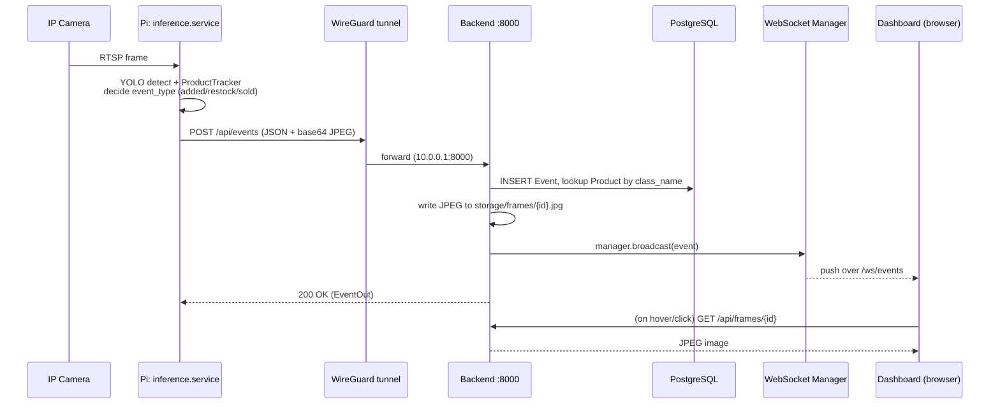
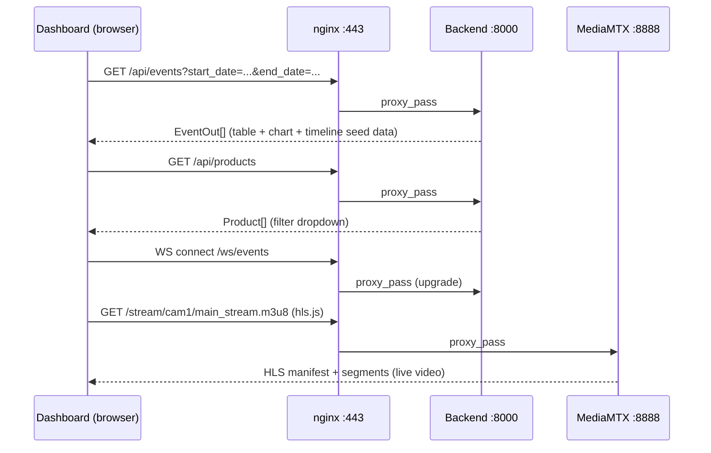

# Birmas CCTV System — API Diagram

Base URL (public): `https://170.64.149.147`
Internal base URL (Pi → backend, over WireGuard): `http://10.0.0.1:8000`
All REST responses are JSON unless noted. Auth: JWT bearer token (HS256),
obtained via `/api/users/login`.

## Endpoint reference

| Method | Path | Auth | Caller | Purpose |
|---|---|---|---|---|
| POST | `/api/users/register` | none | (admin/manual) | Create a dashboard user account |
| POST | `/api/users/login` | none | Browser (Login.vue) | Exchange username/password for a JWT |
| POST | `/api/events` | none¹ | Pi `inference.service` | Ingest a new detection event (+ optional frame) |
| GET | `/api/events` | none¹ | Browser (Dashboard/EventTable) | Query historical events with filters |
| GET | `/api/frames/{event_id}` | none¹ | Browser (Dashboard, timeline hover/click) | Fetch the JPEG frame captured for an event |
| GET | `/api/camera-status` | none¹ | Browser (StatsBar) | Check whether MediaMTX sees the camera as online |
| GET | `/api/products` | none¹ | Browser (Dashboard filters) | List known product classes (brand/name/class_id) |
| GET | `/api/stats/counts` | none¹ | Browser (CountChart) | Time-bucketed event counts for charting |
| WS | `/ws/events` | none¹ | Browser (Dashboard, live) | Real-time push of newly created events |

¹ *These endpoints currently have no auth middleware applied — only
`/api/users/*` deals with credentials. If you want to lock down event
ingestion/reads, add a dependency that validates the JWT (or a shared
secret for the Pi→backend POST) — see "Suggested hardening" below.*

## Request/response shapes

### `POST /api/events` (ingest — called by the Pi)
```jsonc
// Request
{
  "camera_id":  "cam1",
  "ts":         "2026-07-13T10:42:31+07:00",   // optional, defaults to server "now" (WIB)
  "label":      "ot_apihjB",                    // YOLO class name
  "bbox":       "[412, 88, 560, 310]",           // string-encoded box
  "confidence": 0.83,
  "event_type": "sold",                          // "added" | "restock" | "sold"
  "frame":      "<base64 JPEG>"                  // optional
}

// Response (201) — EventOut
{
  "id": 1042,
  "camera_id": "cam1",
  "ts": "2026-07-13T10:42:31",
  "label": "ot_apihjB",
  "bbox": "[412, 88, 560, 310]",
  "product_brand": "OT",
  "product_name": "Apel Hijau",
  "confidence": 0.83,
  "event_type": "sold"
}
```

### `GET /api/events` (query — called by dashboard)
Query params (all optional): `camera_id`, `start_date`, `end_date`,
`event_type`, `product_name`, `min_confidence`, `limit` (default 500, max
5000). Returns `EventOut[]`, most recent first.

### `GET /api/frames/{event_id}`
Returns the raw JPEG (`image/jpeg`) saved at ingest time, or `404` if no
frame was captured for that event.

### `GET /api/camera-status`
```jsonc
{ "cameras": [ { "id": "cam1", "online": true }, { "id": "cam1_raw", "online": true } ] }
```
Proxies MediaMTX's own `:9997/v3/paths/list` and reduces it to just
name + online flag.

### `GET /api/products`
```jsonc
[ { "class_id": 6, "class_name": "ot_apihjB", "product_brand": "OT", "product_name": "Apel Hijau" }, ... ]
```

### `GET /api/stats/counts?camera_id=cam1&interval=hour`
```jsonc
{ "labels": ["2026-07-13T00:00:00", "2026-07-13T01:00:00", ...], "counts": [3, 5, ...] }
```
`interval` is any value accepted by Postgres `date_trunc` (`hour`, `day`, `month`, ...).

### `WS /ws/events`
No handshake payload needed — connect and receive JSON messages pushed
whenever `POST /api/events` succeeds, shaped identically to the
`POST /api/events` response body above. The dashboard uses this to update
the timeline/table/chart live without polling.

### `POST /api/users/register`
```jsonc
// Request
{ "username": "manager1", "password": "..." }
// Response — UserOut
{ "id": 3, "username": "manager1" }
```

### `POST /api/users/login`
```jsonc
// Request
{ "username": "manager1", "password": "..." }
// Response — TokenOut
{ "access_token": "<jwt>", "token_type": "bearer" }
```

## Sequence: live detection event reaching the dashboard



## Sequence: dashboard initial load



## Suggested hardening (not yet implemented)

- `POST /api/events` currently has no authentication — anything that can
  reach `10.0.0.1:8000` over the WireGuard interface can inject fake
  events. Since only the Pi is a WireGuard peer today, this is low risk,
  but if more devices join the VPN later, consider a shared bearer token
  checked via `Depends()` on the events router.
- `GET /api/events`, `/api/frames`, `/api/products`, `/api/stats/counts`
  are reachable by anyone who loads the dashboard HTML (no login check) —
  if data sensitivity increases, wrap these routes with the same JWT
  dependency already used implicitly by having a login page.
