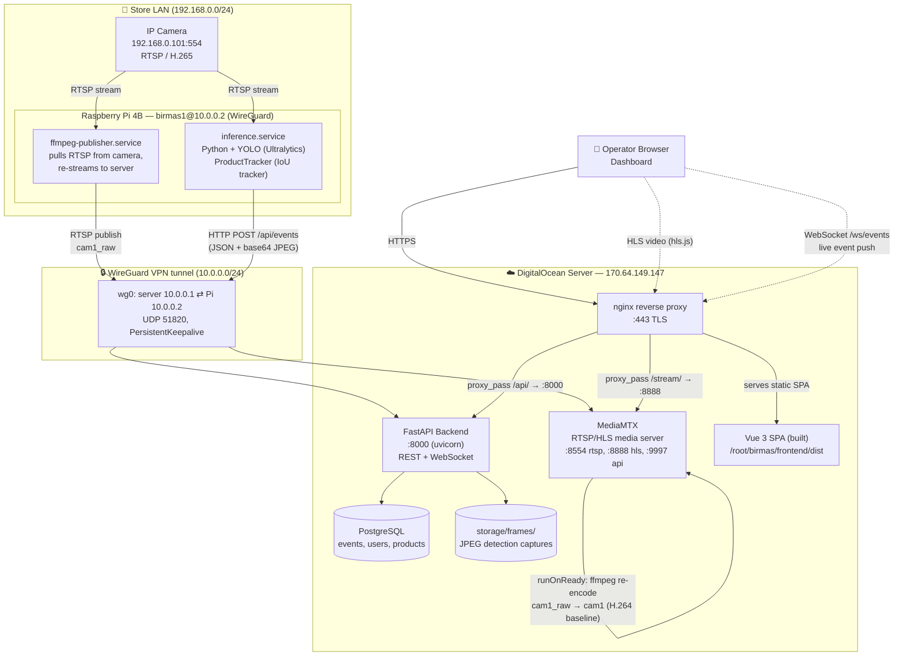

# Birmas CCTV System — Architecture

This document describes the overall system architecture of the Birmas smart
CCTV / inventory-detection system: a Raspberry Pi at the store captures video
from an IP camera, runs YOLO product-detection inference, and reports
"added / restock / sold" events to a cloud server, which stores them and
serves a live dashboard (live video + event timeline + charts).

## High-level component diagram

## Components

### 1. Camera (store)
- Hikvision-style IP camera, RTSP source at `192.168.0.101:554/Streaming/Channels/101`.
- Two consumers on the Pi pull from it independently: the publisher (for live
  video relay) and the inference process (for detection).

### 2. Raspberry Pi (store edge device)
- **`ffmpeg-publisher.service`** — a thin relay: pulls the camera's RTSP
  stream and republishes it over the WireGuard tunnel to the server's
  MediaMTX instance at `rtsp://10.0.0.1:8554/cam1_raw`. Runs as a systemd
  service (`Restart=always`), defined in `systemd/ffmpeg-publisher.service`.
- **`inference.service`** — Python process (`inference/main.py`) that:
  1. Opens its own RTSP connection to the camera.
  2. Runs YOLO (Ultralytics, `inference/models/best.pt`) per frame to detect
     products.
  3. Feeds detections into a lightweight local IoU-based tracker
     (`inference/tracker.py`, class `ProductTracker`) to assign stable
     track IDs and decide `added` / `restock` / `sold` transitions based on
     dwell time (`LOG_TTL`) and/or a configured fridge zone (`FRIDGE_ZONE`).
  4. POSTs each event as JSON (including a base64-encoded JPEG frame
     capture) to the backend's `/api/events` endpoint over the WireGuard
     tunnel.
  - Runs inside a Python venv at `~/birmas/venv` built with
    `--system-site-packages` so it can reuse apt-installed ARM-optimized
    wheels for opencv/torch/scipy/torchvision (pip-compiling these from
    source on Pi previously caused OOM crashes).

### 3. WireGuard VPN
- Private overlay network `10.0.0.0/24` between server (`10.0.0.1`) and Pi
  (`10.0.0.2`). This is the **only** path between store and cloud — the Pi
  is never directly exposed to the internet, and the backend API/RTSP ports
  are not published on the server's public interface.

### 4. Server — MediaMTX
- Receives the raw camera relay on `cam1_raw`.
- A `runOnReady` hook re-encodes `cam1_raw` (H.265, whatever bitrate the
  camera provides) into `cam1` (H.264 baseline, 854×480, 800kbps,
  zero-latency tuned) suitable for low-latency HLS playback in the browser.
- Exposes HLS output at `:8888` and a small HTTP control API at `:9997`
  (used by the backend's `/api/camera-status` endpoint to check whether the
  camera is currently publishing).

### 5. Server — FastAPI Backend
- REST + WebSocket API (`backend/app.py`, routes under `backend/routes/`).
- Persists events/users/products to PostgreSQL (`backend/models.py`,
  `backend/db.py`).
- Broadcasts newly created events to connected dashboard clients in
  real-time over `/ws/events` (in-process `ConnectionManager`).
- Serves saved detection frame JPEGs from `storage/frames/` via
  `/api/frames/{event_id}`.
- See `docs/api-diagram.md` for the full endpoint reference.

### 6. Server — nginx
- Terminates TLS (self-signed cert) on `:443`.
- Serves the built Vue SPA (`frontend/dist`) as static files with SPA
  fallback (`try_files ... /index.html`).
- Reverse-proxies:
  - `/api/*` → backend `:8000`
  - `/stream/*` → MediaMTX HLS `:8888`
  - `/ws/events` → backend websocket
- A second nginx `server{}` block listens on `10.0.0.1:8000` (WireGuard
  interface only) so the Pi can reach the backend API without traversing
  the public internet.

### 7. Frontend — Vue 3 dashboard
- `LivePlayer.vue` — plays the HLS stream via `hls.js`, using a relative
  `/stream/...` path so the browser never needs to know about MediaMTX or
  the WireGuard IP directly (avoids CORS/mixed-content issues).
- `Dashboard.vue` — composes `TimelineScrubber.vue` (24h timeline with
  sold/restock/detected markers), `EventTable.vue`, `CountChart.vue`,
  `StatsBar.vue`.
- `api.js` — thin fetch wrapper for calling the backend REST endpoints and
  opening the `/ws/events` WebSocket for live updates.

## Data flow summary (one detection, end to end)

1. Camera streams RTSP → Pi.
2. `inference.service` grabs a frame, runs YOLO, tracker decides this is a
   new "sold" event.
3. Pi POSTs `{camera_id, label, bbox, confidence, event_type, frame(base64)}`
   to `https://10.0.0.1:8000/api/events` (over WireGuard, via the
   WG-only nginx block).
4. Backend looks up the product name/brand from the `product` table,
   inserts an `Event` row, writes the JPEG to `storage/frames/`, and
   broadcasts the event over the WebSocket to any connected dashboards.
5. Browser dashboard receives the WebSocket push, updates the timeline,
   table, and chart live — no polling needed for new events (only initial
   load and filter changes use REST `GET /api/events`).
6. Meanwhile, the live video for that same moment is available via
   `GET /stream/cam1/main_stream.m3u8`, independent of the event pipeline.

## Key design decisions & constraints

- **Model weights (`*.pt`) are never committed to git** (`.gitignore`
  excludes them) — they are large binary artifacts, manually kept in sync
  between server and Pi via `scp`. See `docs/developer-guide.md` for the
  swap procedure.
- **Pi is CPU-only** (no GPU) — inference throughput is the binding
  constraint on detection latency, not network bandwidth.
- **WireGuard, not port-forwarding** — chosen so the Pi/camera are never
  directly reachable from the internet; only the server's public IP is
  exposed, and only through nginx TLS.
- **Two MediaMTX paths (`cam1_raw`, `cam1`)** — the raw relay preserves
  original camera codec/bitrate (useful for debugging/inference), while the
  `cam1` re-encode is deliberately downscaled/tuned for reliable low-latency
  browser playback over the internet.
