# Birmas CCTV System — Dashboard

Describes every visible section of the operator dashboard
(`frontend/src/pages/Dashboard.vue`), what data powers it, and which
backend endpoint each piece calls. Screenshot the diagram/table below for
a slide that walks through the UI top-to-bottom.

## Dashboard layout diagram

```mermaid
flowchart TB
    subgraph HEADER["Header"]
        H1["Birmas logo"]
        H2["Dark/Light mode toggle"]
        H3["Logout button<br/>+ idle-timeout warning"]
    end

    subgraph CAMSEC["Camera Section"]
        C1["Selected Camera player<br/>(LivePlayer.vue — hls.js)"]
        C2["All Cameras grid<br/>(thumbnails + online/offline dot,<br/>click to switch selected camera)"]
    end

    STATS["Stats Bar<br/>(StatsBar.vue) — quick counts for<br/>the active camera + time filter"]

    subgraph TIMELINE["Timeline section"]
        T1["Date picker + ◀ Today ▶ controls"]
        T2["TimelineScrubber.vue<br/>24h horizontal line, hourly dots,<br/>sold/restock/detected markers,<br/>draggable time-cursor"]
    end

    subgraph FILTERROW["Filter row (for table + chart)"]
        F1["Time range: 1 Day / Week / Month /<br/>3 Months / Year / Custom"]
        F2["Status filter: All / Detected / Sold /<br/>Restocked / Missing"]
        F3["Confidence ≥ slider (0-99%)"]
        F4["Selected Cam ⇄ All Cams toggle"]
    end

    subgraph TABLECHART["Table + Chart section"]
        D1["EventTable.vue<br/>Recent Events list, filterable"]
        D2["CountChart.vue<br/>Product Count Statistics (bar/line)"]
    end

    TOAST["ToastNotif.vue<br/>transient popup for new live events"]

    HEADER --> CAMSEC --> STATS --> TIMELINE --> FILTERROW --> TABLECHART
    TABLECHART -.-> TOAST
```



## Section-by-section reference

| Section | Component | Data source | Notes |
|---|---|---|---|
| Camera player | `LivePlayer.vue` | `GET /stream/{camera_id}/index.m3u8` (HLS, via nginx → MediaMTX) | Uses `hls.js`; relative URL avoids CORS/mixed-content |
| All Cameras grid | inline in `Dashboard.vue` (`cameras` array) | static thumbnail image + `GET /api/camera-status` for the online/offline dot | **Currently hardcoded to one camera (`cam1`)** — see `multi-device-scaling.md` for how to add more |
| Stats Bar | `StatsBar.vue` | `GET /api/stats/counts?camera_id=...&interval=...` | Quick aggregate counts for the active camera/time filter |
| Timeline | `TimelineScrubber.vue` | `GET /api/events?camera_id=...&start_date=...&end_date=...` (one day at a time) + `GET /api/frames/{event_id}` on hover/click | 25 hour-marks (00:00–24:00), colored markers for sold (green, up)/restock (blue, down)/detected (red, down); draggable vertical scrubber; click timeline to jump; click a dot to expand frame+details full-page |
| Filter row | inline in `Dashboard.vue` | client-side state, passed as props to `EventTable`/`CountChart` | Positioned below the timeline (its own date picker is independent of this row's time-range filter) |
| Recent Events table | `EventTable.vue` | `GET /api/events` with filters (`camera_id`, date range, `event_type`, `product_name`, `min_confidence`) | Paginated/limited list (`limit`, max 5000) |
| Product Count chart | `CountChart.vue` | `GET /api/stats/counts` (via Chart.js) | Time-bucketed bar/line chart |
| Live toast notifications | `ToastNotif.vue` | `WS /ws/events` | Pops up briefly whenever the backend broadcasts a new event, independent of whatever filter/date range is currently displayed |

## State model (client-side, in `Dashboard.vue`)

| State | Purpose |
|---|---|
| `selectedCam` | which camera's player/thumbnail is highlighted |
| `showAllCams` | toggles whether table/chart/stats query a single camera or aggregate all |
| `activeFilter` | table/chart time range (`day`\|`week`\|`month`\|`3months`\|`year`\|`custom`) |
| `customFrom` / `customTo` | used only when `activeFilter === 'custom'` |
| `filterStatus` | table/chart event-type filter |
| `minConfidence` | table/chart confidence threshold |
| `timelineDate` | independent date selector just for the timeline (defaults to today, WIB) |
| `idleWarning` | shown when the session is about to auto-logout from inactivity |
| `dark` | dark/light mode, persisted via `useDarkMode.js` |

Note the **timeline's date and the table/chart's time-range filter are
intentionally independent** — you can look at today's timeline while the
table below still shows "Last 1 Month" aggregated stats.

## Real-time update path

The dashboard does **not** poll for new events. On mount it opens a
WebSocket to `/ws/events` (proxied by nginx to the backend); every time
`POST /api/events` succeeds server-side, the backend broadcasts the new
event JSON to all connected sockets, and the dashboard:
1. Prepends the event to the `EventTable` (if it matches current filters).
2. Nudges the `CountChart` bucket it falls into.
3. Adds/updates a marker on `TimelineScrubber` if the event's date matches
   the currently selected `timelineDate`.
4. Pops a `ToastNotif`.

This means only the **initial load** and **filter/date changes** trigger
REST `GET` calls — everything else arrives live over the WebSocket.

## Adding a second camera to the UI

Today `cameras` is a hardcoded array in `Dashboard.vue`:
```js
const cameras = [
  { id: 'cam1', name: 'Sudirman', thumbnail: '/images/sudirman.jpg' },
]
```
To surface a second device on the dashboard, add another entry here (and
a thumbnail image under `frontend/public/images/`) — see
`docs/multi-device-scaling.md` for the full checklist across camera →
Pi → server → dashboard.
