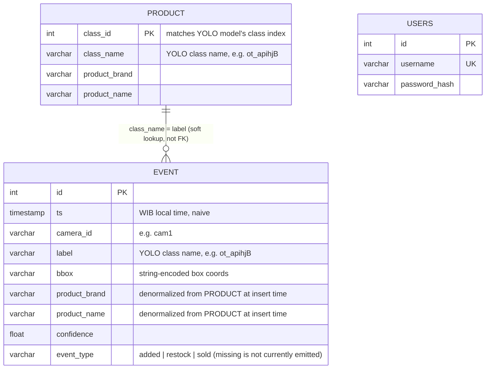

# Birmas CCTV System — Database

Backend persistence layer: PostgreSQL, accessed via SQLAlchemy
(`backend/db.py`, `backend/models.py`). Current size ~8.8 MB (3,225 events,
2 users, 105 product classes as of this writing).

## Entity-relationship diagram



## Tables

### `users`
| Column | Type | Notes |
|---|---|---|
| `id` | int, PK | |
| `username` | varchar, unique index | login identifier |
| `password_hash` | varchar | bcrypt hash (never store plaintext) |

Only 2 rows currently exist (dashboard operator accounts). Created via
`POST /api/users/register`.

### `events`
| Column | Type | Index | Notes |
|---|---|---|---|
| `id` | int, PK | ✓ | autoincrement |
| `ts` | timestamp (naive, WIB/UTC+7) | ✓ (`ix_events_id` on ts, plus composite `ix_events_ts_camera`) | defaults to `now_wib()` if not supplied by the Pi |
| `camera_id` | varchar | ✓ | which camera/device produced this event — **this is the field that scales to multiple devices** |
| `label` | varchar | ✓ | raw YOLO class name at detection time |
| `bbox` | varchar | — | string-encoded bounding box, e.g. `"[x1,y1,x2,y2]"` |
| `product_brand` / `product_name` | varchar | — | denormalized copy of the matching `product` row, resolved once at insert time (so historical events keep their labels even if `product` mapping changes later) |
| `confidence` | float | — | YOLO detection confidence |
| `event_type` | varchar | ✓ | `added` \| `restock` \| `sold` — decided by `inference/main.py` (added/restock via `FRIDGE_ZONE`, sold via `LOG_TTL` disappearance timeout). `missing` appears in older docs/diagrams but is not currently emitted anywhere in code. |

3,225 rows currently — this is the fast-growing table. Indexes are already
in place for the query patterns the API uses (`camera_id`, `event_type`,
`ts`, `label`, and the composite `ts+camera_id` for the common
"events in this camera's time range" query).

### `product`
| Column | Type | Notes |
|---|---|---|
| `class_id` | int | matches the YOLO model's output class index — **must stay in sync with whatever `best.pt` is currently deployed**. **Not a real primary key** — `class_id` is reused across different brand/dataset batches (e.g. Orang Tua's `class_id=0` and Sababay's `class_id=0` are different rows), so it cannot have a unique/PK constraint at the table level. |
| `class_name` | varchar, **UNIQUE** | YOLO class name (e.g. `ot_apihjB`) — this is the actual lookup key matched against `Event.label` at insert time. A `product_class_name_uniq` constraint was added 2026-07-20 since this is the real identity column. |
| `product_brand` | varchar | human-readable brand for the dashboard |
| `product_name` | varchar | human-readable product name for the dashboard |

109 rows — one per trained product class across all brands. **This table
is the bridge between the YOLO model's numeric/coded classes and
human-readable labels shown on the dashboard.** If you retrain the model
with new/renamed/reordered classes, this table must be updated to match
(`class_name` values, specifically), or new detections will show
`product_brand = "Unknown"` (see fallback logic in
`backend/routes/events.py::post_event`).

**2026-07-20 incident**: 12 Orang Tua rows had a stale `01ot_` prefix on
`class_name` that never matched the deployed model's actual `ot_`-prefixed
class names, and 4 of the model's 16 classes had no row at all — both
caused 100% of Orang Tua events (12,972 rows) to show `product_brand =
"Unknown"`. Fixed via `scripts/2026-07-20_fix_product_classnames.sql`,
which also backfilled the historical `events` rows (see below — the
brand/name are copied onto `Event` at insert time, not joined live, so
fixing `product` alone does not retroactively fix old event rows). Two of
the newly added rows (`ot_apibcB`, `ot_atlaspB`) and one existing
(`ot_gintB`) have **unconfirmed/best-guess product names** pending owner
verification — check the `product` table for `"unconfirmed"` in
`product_name`.

## Where the schema lives and how it's created

- **No migration tool (Alembic, etc.) is currently used.** Tables are
  defined as SQLAlchemy models in `backend/models.py` and presumably
  created once via `Base.metadata.create_all(engine)` (check
  `backend/app.py` / a one-off init script) or manually via `psql`.
- **Schema changes today are manual**: if you add a column, you must
  `ALTER TABLE` by hand on both the model definition and the live
  database — there's no `alembic upgrade head` safety net. Consider
  introducing Alembic before the schema grows further, especially once
  multiple devices start writing concurrently (see multi-device doc).

## Connection & pooling

```python
# backend/db.py
engine = create_engine(
    DATABASE_URL,
    pool_pre_ping=True,   # validates connections before use (recovers from stale/dropped conns)
    pool_recycle=3600,    # recycle every hour (avoids stale SSL/idle-timeout issues)
    pool_size=5,
    max_overflow=10,
)
```
`pool_size=5` + `max_overflow=10` = up to 15 concurrent DB connections.
This is comfortable for the current single-Pi, low-concurrency dashboard
load, but **should be revisited if multiple Pi devices are added** and
each POSTs events frequently, plus multiple dashboard browser sessions
querying simultaneously (see `docs/multi-device-scaling.md`).

## Connecting with an external GUI client (DBeaver, etc.)

Postgres is deliberately configured to **only listen on `localhost`**
(`listen_addresses = 'localhost'` in `postgresql.conf`) — it is never
exposed on the server's public interface, regardless of what
`pg_hba.conf` allows. This is intentional: it means the database can
never be reached directly from the internet, even if someone knows the
password, without also having valid SSH access to the server.

To connect from a local GUI client, use an **SSH tunnel**, not a direct
connection:

1. In DBeaver, create a new PostgreSQL connection.
2. **Main tab**: Host = `localhost` (or `127.0.0.1`) — **not** the
   server's public IP. This is the address as seen *from the server
   itself* once the tunnel is up, since that's where Postgres actually
   listens. Port `5432`, Database `birmas`, Username `birmas_user`,
   Password from the server's `/root/birmas/.env` (`DATABASE_URL`).
3. **SSH tab**: enable "Use SSH Tunnel". Host/IP = `170.64.149.147`,
   Port `22`, your normal SSH username/auth (key or password).
4. Test the SSH tunnel first (DBeaver has a "Test Tunnel Configuration"
   button), then test the full connection.

**Common mistake**: leaving the Main tab's Host set to the public IP
(`170.64.149.147`) while also enabling the SSH tunnel. DBeaver's tunnel
makes the *SSH server* (the droplet) open the Main-tab host/port on its
own behalf — pointing that at its own public IP (rather than `localhost`)
means the droplet tries to connect to itself over an interface Postgres
isn't listening on, which fails immediately (commonly surfaces as an
`EOFException` in the JDBC driver, since the TCP connection is refused
right after the handshake begins). Setting Main-tab Host to `localhost`
fixes this.

## Data growth & retention

- No automatic pruning/retention policy currently exists — `events` grows
  unbounded. At ~3,225 rows / 8.8 MB total DB, this isn't urgent, but
  worth planning a retention policy (e.g. archive events older than N
  months to cold storage) before it becomes thousands of events/day across
  multiple devices.
- `storage/frames/{event_id}.jpg` grows in lockstep with `events` — each
  event with a captured frame adds one JPEG file on disk. This is
  currently unbounded and **not tracked in git** — monitor disk usage
  (`du -sh storage/frames/`) periodically, especially after adding more
  cameras.
