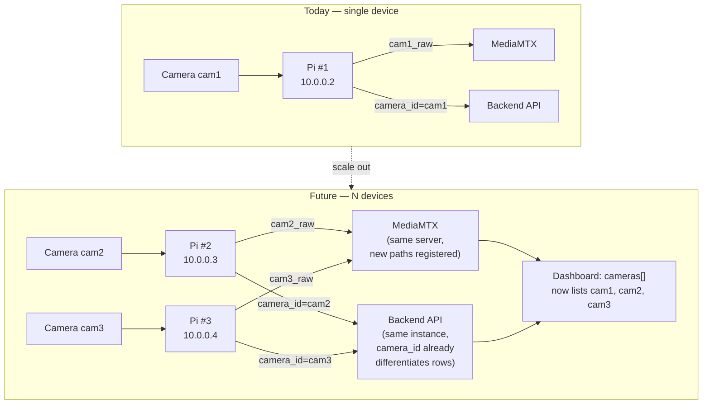

# Birmas CCTV System — Adding More Devices (Cameras / Pis)

The system currently runs **one** Raspberry Pi + **one** IP camera
(`cam1` / `Sudirman`). Nearly every layer — WireGuard, MediaMTX, the
inference service, the database, and the dashboard — has some hardcoded
assumption of a single device. This document lists exactly what must
change at each layer to add a second (or Nth) store/camera, in the order
you'd actually do the work.

## What "a device" means here

One logical "device" = one Raspberry Pi + the IP camera(s) it manages.
Each Pi needs its own WireGuard identity, its own `ffmpeg-publisher` +
`inference` services, and a unique `camera_id` namespace on the server
side. Two Pis can share one server (this is the intended scale-out path —
the server side is already multi-tenant-capable via `camera_id`; only the
config is currently single-camera).

## End-to-end diagram: 1 device today → N devices tomorrow



## Checklist: what to add/change per new device

### 1. Networking — WireGuard (server)
- Generate a new keypair on the new Pi: `wg genkey | tee privatekey | wg pubkey > publickey`.
- Add a new `[Peer]` block to the server's `/etc/wireguard/wg0.conf`:
  ```ini
  [Peer]
  PublicKey = <new-pi-public-key>
  AllowedIPs = 10.0.0.3/32   # next free /32 in the 10.0.0.0/24 VPN subnet
  ```
- Apply without downing the existing tunnel:
  `wg syncconf wg0 <(wg-quick strip wg0)`.
- Configure the new Pi's own `wg0.conf` with `Address = 10.0.0.3/24`, the
  server as its only peer (`AllowedIPs = 10.0.0.0/24`), server's public
  endpoint, `PersistentKeepalive = 25`.

### 2. Camera + Pi (edge device)
- Physically install camera, note its LAN IP/gateway on that store's
  network (independent from other stores' LANs — they don't need to be on
  the same subnet).
- Clone the repo onto the new Pi (`git clone` — same repo as everyone
  else), recreate the venv (`--system-site-packages`, see
  `developer-guide.md`).
- Copy `inference/models/best.pt` to the new Pi (same model, unless this
  store has different lighting/planogram needs — could eventually warrant
  a per-device model).
- Duplicate and edit the two systemd unit files for this device:
  - `ffmpeg-publisher.service` → change `STREAM_URL` to the new camera,
    and change the target path from `cam1_raw` to `cam2_raw` (edit the
    `ExecStart` line).
  - `inference.service` → change `STREAM_URL` to the new camera, and set
    a new `API_ENDPOINT` camera identifier (see below) — actually
    `camera_id` is set inside `inference/main.py`'s event payload, not an
    env var today; **add a `CAMERA_ID` env var and read it in
    `main.py`** so the same codebase can run for any device without
    editing source per-Pi (currently `camera_id` may be hardcoded —
    verify/param­eterize before cloning to a second device).

### 3. Server — MediaMTX
- Add new path entries in `mediamtx.yml` for the new camera, mirroring
  the existing `cam1_raw` / `cam1` pattern:
  ```yaml
  paths:
    cam2_raw:
      runOnReady: >
        ffmpeg ... -i rtsp://127.0.0.1:8554/cam2_raw ... -f rtsp rtsp://127.0.0.1:8554/cam2
      runOnReadyRestart: true
    cam2:
      source: publisher
      overridePublisher: yes
  ```
- Restart/reload MediaMTX (`systemctl reload mediamtx` if supported, else
  `restart`) after editing.

### 4. Server — nginx
- No change needed for the HLS proxy (`location /stream/` already proxies
  the whole MediaMTX HLS namespace, so `/stream/cam2/...` works
  automatically once the path exists in MediaMTX).
- No change needed for `/api/` proxy either (all devices share the same
  backend).

### 5. Server — Database
- No schema change needed — `Event.camera_id` and `Product.class_id`
  already support multiple cameras/products; just make sure the new
  device's `inference/main.py` posts a distinct, consistent `camera_id`
  (e.g. `cam2`) in every event payload.
- If different stores stock **different product sets**, you may need
  per-store product tables or a `store_id` column added to `product` and
  `events` — evaluate once a second physical store (not just a second
  camera in the same store) is added.
- Re-check connection pool sizing (`pool_size=5, max_overflow=10` in
  `backend/db.py`) once multiple Pis are POSTing events concurrently —
  15 total connections may need to grow.

### 6. Server — Backend
- No route changes needed — `/api/events`, `/api/camera-status`,
  `/api/stats/counts` already accept/filter by `camera_id`.
- `GET /api/camera-status` already reflects however many paths MediaMTX
  reports, so it will automatically show the new camera once step 3 is
  done.

### 7. Frontend — Dashboard
- Add an entry to the hardcoded `cameras` array in `Dashboard.vue`:
  ```js
  const cameras = [
    { id: 'cam1', name: 'Sudirman', thumbnail: '/images/sudirman.jpg' },
    { id: 'cam2', name: 'New Store Name', thumbnail: '/images/newstore.jpg' },
  ]
  ```
- Add the new thumbnail image to `frontend/public/images/`.
- Everything else (`StatsBar`, `EventTable`, `CountChart`,
  `TimelineScrubber`) already accepts `camera` as a prop and either a
  specific `camera_id` or `'all'` — no further code changes needed there,
  since they all delegate filtering to the backend via query params.
- Rebuild + redeploy: `npm run build` in `frontend/`.

### 8. Git sync
- As always: commit config/systemd/frontend changes on whichever host you
  edited, push, then `git pull` on the server and every Pi so all copies
  of the repo match. Model weights and any per-Pi `.env`/systemd files
  stay device-local (not committed) — track those manually per device in
  this document or a small device inventory table (see below).

## Proposal under consideration: chiller camera + cashier camera (2026-07-20)

The owner is considering: (1) moving the current camera physically closer
to the chiller/fridge to improve detection confidence/recall (small,
distant bounding boxes are a real limiting factor on `01ot_v4`'s
precision/recall — see training review notes), and (2) adding a **second**
camera dedicated to the cashier/register area.

**Recommendation: yes, do both — and use the second camera to fix the
"sold" logic properly.** Today's `event_type="sold"` (see
`architecture.md`) is a pure disappearance timeout (`LOG_TTL`, 20s) — it
does not know whether a product was actually purchased, just that the
chiller camera hasn't seen it in a while. In a dine-in setting this is
inherently fuzzy (products leave/re-enter frame for all kinds of reasons).
A cashier-facing camera can instead detect the product being scanned/
placed at the register and post `sold` **directly and deterministically**,
the same way `FRIDGE_ZONE` already deterministically decides `added` vs
`restock` today.

### What this requires (not yet implemented)
1. **`camera_id` must stop being hardcoded** in `inference/main.py` (see
   "Things that will NOT scale as-is" below) — each camera's process needs
   to post its own distinct `camera_id` (e.g. `cam1_chiller`, `cam2_cashier`).
2. **Two inference processes**, one per camera/zone:
   - Chiller camera keeps today's logic: `FRIDGE_ZONE` decides
     added/restock; `LOG_TTL` disappearance still decides `sold` as a
     fallback for products that leave the chiller's own view without ever
     reaching the cashier's camera (e.g. a customer changes their mind and
     puts it back, or walks out of frame not through the register).
   - Cashier camera runs a **new, simpler event type** — e.g. `sold`
     posted the moment the same product class is detected inside a
     `CASHIER_ZONE` — no tracker/dwell logic needed there, just "product X
     seen at the register." This event should take priority: if a cashier
     event arrives for a track that's still open on the chiller side, the
     backend (or a small reconciliation step) should close that chiller
     track as `sold` immediately instead of waiting for `LOG_TTL` to expire.
3. Whether the two cameras run on **one Pi with two `cv2.VideoCapture`
   threads** or **two separate Pi devices** depends on CPU headroom — check
   current Pi CPU/thermal margin under a single stream before assuming it
   can run two YOLO inference loops concurrently; a second Pi is safer if
   in doubt.
4. Each camera needs its own MediaMTX path (`cam1_raw`/`cam1`,
   `cam2_raw`/`cam2`) and its own entry in the frontend's `cameras` array
   (see step 7 above) so the dashboard can show both live feeds side by
   side or via a camera switcher.
5. Matching a chiller-side track to a cashier-side detection reliably
   (so you don't double-count) needs some thought — simplest starting
   point is matching by `class_name` within a short time window (e.g. a
   cashier detection of `ot_amerB` within 2 minutes of a chiller `added`
   event for the same class marks that chiller track `sold`), accepting
   that it won't be perfectly precise if multiple units of the same
   product are in play at once.

This is a real code change (new `CASHIER_ZONE`/second-camera config,
tracker/event reconciliation logic) — not yet implemented as of this
writing. Flagging the design here so it's ready to pick up once the
camera hardware move happens.


| Device | Store/Location | Camera IP | Pi WireGuard IP | `camera_id` | Notes |
|---|---|---|---|---|---|
| Pi #1 | (current store) | 192.168.0.101 | 10.0.0.2 | `cam1` | Live in production |
| Pi #2 | _TBD_ | _TBD_ | 10.0.0.3 (next free) | `cam2` | Not yet deployed |

## Things that will NOT scale as-is and should be revisited

- **`camera_id` may be hardcoded in `inference/main.py`** rather than
  read from an environment variable — confirm and parameterize before
  cloning the inference service to a second Pi, otherwise both devices
  will report events under the same `camera_id` and be indistinguishable
  in the dashboard/database.
- **Single shared PostgreSQL instance with no per-store partitioning** —
  fine for a handful of devices, but if this grows to dozens of stores,
  consider partitioning `events` by `camera_id` or date for query
  performance.
- **No device health/monitoring dashboard** — today you manually SSH in
  and check `systemctl status` / MediaMTX `paths/list` per device. With
  more than 2-3 devices, a simple heartbeat table (`device_id`,
  `last_seen`) plus a dashboard status panel would save a lot of manual
  SSH checking.
- **WireGuard `AllowedIPs` and peer list grow linearly** — manageable
  manually up to maybe 5-10 peers; beyond that, consider a WireGuard
  config-management script instead of hand-editing `wg0.conf`.
