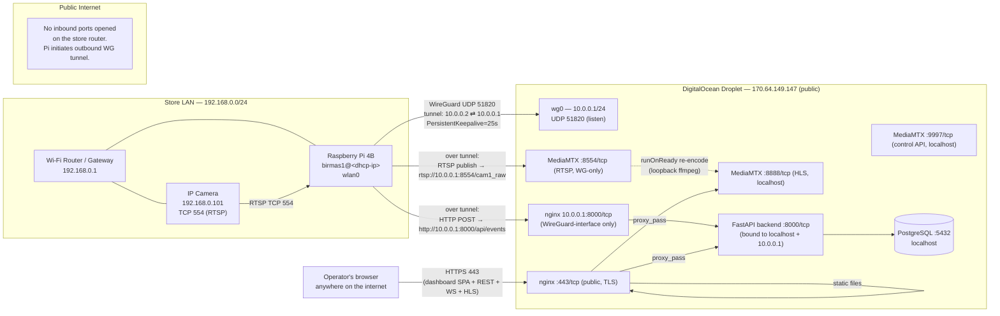

# Birmas CCTV System — Network Diagram

Physical/network topology: what talks to what, over which protocol, on
which port, and why. This complements `architecture.md` (component
responsibilities) with a pure networking view.

## Address / port reference table

| Host | Interface | Address | Notes |
|---|---|---|---|
| IP Camera | store LAN | `192.168.0.101` | RTSP `554`, gateway `192.168.0.1` |
| Raspberry Pi | wlan0 (store LAN) | DHCP-assigned | Changes if router/SSID changes — re-pair WireGuard after |
| Raspberry Pi | wg0 (VPN) | `10.0.0.2/32` | Fixed VPN address, `AllowedIPs` on server peer |
| Server | public (eth) | `170.64.149.147` | Only nginx `:443` (and SSH) should be internet-facing |
| Server | wg0 (VPN) | `10.0.0.1/24` | WireGuard listen port `UDP 51820` |
| Server | localhost | `127.0.0.1` | MediaMTX HLS `:8888`, API `:9997`, backend `:8000`, PostgreSQL `:5432` |

## Why this topology

- **No inbound firewall rules needed on the store router.** WireGuard is a
  UDP hole-punch/tunnel initiated outbound from the Pi, so the store's home
  router needs zero port-forwarding — this is what lets the system survive
  the user changing Wi-Fi SSID/router without reconfiguring NAT rules (only
  the Pi's WireGuard peer keys/IP needed re-establishing).
- **RTSP and the backend API are only reachable via the WireGuard
  interface**, not the public interface — even if someone found the Pi's
  public IP, they cannot reach the camera relay or push fake events without
  being a trusted WireGuard peer.
- **The browser never talks to MediaMTX or the backend directly by their
  raw ports.** Everything goes through nginx on `:443`, which reverse
  proxies to `127.0.0.1:8888` (HLS) and `127.0.0.1:8000` (API/WS). This
  avoids mixed-content/CORS issues and keeps a single TLS-terminated public
  entry point.
- **Known operational gotcha:** `ffmpeg-publisher` on the Pi can keep its
  process alive while its RTSP socket silently stalls (no crash, no systemd
  restart triggered) — this manifests as the dashboard live feed going
  blank/500 even though `ping`/SSH to the Pi still work. Diagnose with
  `curl http://localhost:9997/v3/paths/list` on the server (look for
  `"ready": false`), fix with `systemctl restart ffmpeg-publisher` on the
  Pi.
